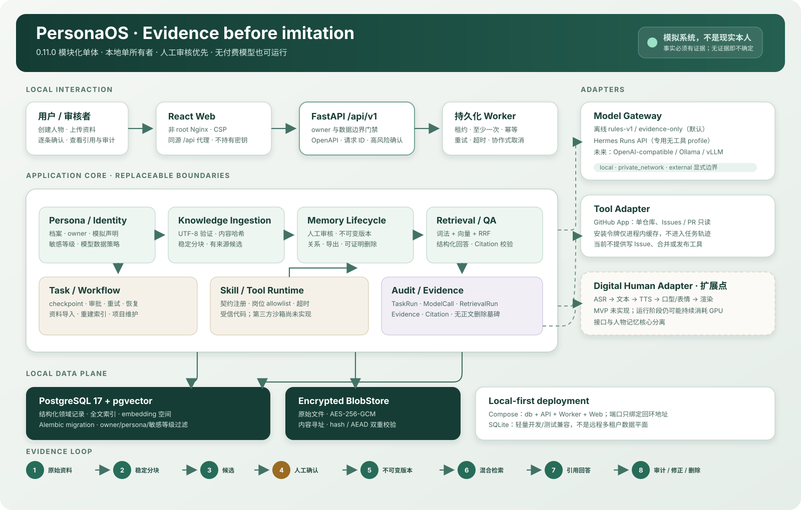

# PersonaOS

一个本地优先、证据驱动、人工审核优先的开源数字员工与数字分身系统。

PersonaOS 不声称复制了现实中的人。它把授权资料、记忆候选、人工确认版本和
原始来源分开保存，使每条长期记忆都可以追溯、审核和纠正。当前 `0.12.0` 已
跑通“创建人物 → 导入文本 → 人工确认 → 混合检索与引用问答 → 版本化修改、
关系、导出或可证明删除”，并增加可信本地账户、可撤销会话、近期再认证、
应用层 owner 过滤与 PostgreSQL RLS。核心闭环无需 API Key 或付费服务。

仓库也保留原有的 GitHub 项目维护数字员工：它只读取公共或已授权仓库，生成
项目简报与 Issue 优先级建议，不修改 Issue、评论、PR 或 Release。建议必须
经过人工审批，用户选择会成为可审核的偏好证据。

**文档入口：** [五分钟演示](#五分钟本地演示) ·
[30～60 秒记忆连续性演示](docs/demos/v0.1-memory-continuity.md) ·
[架构](docs/architecture.md) · [API](docs/api.md) ·
[Skill 开发](docs/skill-development.md) · [路线图](ROADMAP.md) ·
[贡献](CONTRIBUTING.md) · [安全](SECURITY.md) ·
[0.12.0 发布说明](docs/releases/v0.12.0.md)

## 产品形态

产品采用 Web/API 优先：React 工作台只调用同源 API，API、Worker 与可选模型
网关运行在服务端，密钥不会下发到浏览器。生产静态页面由非 root Nginx 提供，
`/api/*` 同源转发到 FastAPI；核心仍是模块化单体和可替换适配器，避免把记忆
语义锁进某个前端或 Agent 框架。

## 已实现的两个产品闭环

    授权 UTF-8 文本 / Markdown
              ↓ AES-256-GCM 原始 Blob
       可复现分块 + 来源定位
              ↓
       有来源的记忆候选
              ↓ 人工确认 / 修订 / 拒绝
     不可变 MemoryVersion + Evidence
              ↓ 仅 confirmed 当前版本
     Embedding Space + 词法/向量/RRF
              ↓
     结构化回答 + 可解析 Citation
              ↓ 无证据时不生成个人事实
       Conversation / ModelCall / Audit

    GitHub 只读快照
          ↓
    project-daily-brief Skill
          ↓
    issue-triage Skill
          ↓
    事实引用与格式质量门禁
          ↓
    人工审批（暂停与恢复）
          ↓
    产物、修改、反馈与决策记录

模型运行时保留确定性的 `rules-v1` 作为免费、离线默认，也可通过隔离适配器接入
Hermes Agent API。业务层只依赖稳定协议；人物资料提取本身不调用模型，规则
提取器只把原文片段变成待审核候选。人物问答的免费默认是本地
`evidence-only` 生成器：它只复述召回的已确认记忆，不把推断写成事实。

Personal Layer 还会把用户对数字员工输出的修改、拒绝和显式反馈保存为来源证据，
生成待审核偏好。只有用户主动确认且未过期的偏好才会进入后续任务上下文。

## 真实性、伦理与算力边界

- PersonaOS 是根据授权资料生成输出的软件，不是现实中的本人，不上传意识、
  不复活逝者，也不自动取得本人身份、同意权或判断权；
- `source_verified` 只表示文字可以定位回原始资料，不表示资料里的陈述在客观
  世界为真；总结、推断、用户设定和临时生成内容必须保持不同标签；
- 没有证据时系统会表达“不确定”或“没有找到相关记忆”，不能让模型补写历史；
- 当前 MVP 只处理文本，没有实现 ASR、TTS、口型、表情或数字人渲染；
- 未来数字人会把形象初始化、文本生成、TTS、面部驱动和渲染分开。生成一次人物
  形象不意味着之后零成本运行：TTS、神经渲染或视频生成在运行时仍可能持续消耗
  CPU/GPU，具体需求取决于适配器；
- 当前可信账户边界仍只面向本机部署，不包含 MFA、账户恢复、集中限流或公网
  身份平台；不要因已有登录就把服务直接暴露到不可信网络。

## 五分钟本地演示

需要 Docker Engine 与 Docker Compose。主机开发基线是 Python 3.11.15；修改
Web 工作台需要 Node.js 22.23.1。首次构建需要下载容器和开源依赖。

最完整的本地基线使用 Docker Compose，一次启动 PostgreSQL/pgvector、API、
Worker 和 Web：

~~~bash
git clone https://github.com/robin-shaun/PersonaOS.git
cd PersonaOS
docker compose up --build --detach --wait
docker compose exec api \
  python -m apps.admin create-account \
  --username admin --display-name Administrator --role admin
~~~

最后一条命令会以无回显方式要求输入并确认至少 15 字符的管理员密码。打开
http://127.0.0.1:18111，使用该账户登录，然后完成：

1. 点击“载入虚构演示人物”；系统只上传仓库内的虚构日记；
2. 在“任务”看到资料处理完成，在“候选审核”逐条核对并明确确认一条；
3. 到“问答”提问“我什么时候加入 PersonaOS 项目？”；
4. 展开回答的 `C1`，检查文件名、原文摘录和行号定位；
5. 在“记忆”查看不可变版本，在“审计”查看创建、上传、处理、确认和问答事件。

演示不需要 API Key，不调用付费模型，也不会自动确认候选。FastAPI 交互文档位于
http://127.0.0.1:18110/docs。

Web 与 API 都只映射到本机回环地址；Compose 会先执行 Alembic migration，并让
API 与 Worker 共享独立的认证/Blob 密钥卷。CI 在一次性空 volume 中创建两个
测试账户，再运行 `examples/compose_smoke.py`：两个账户各自完成完整证据闭环，
并双向探测人物、资料、记忆、任务、引用、导出和删除；随后
`examples/postgres_rls_smoke.py` 直接验证 PostgreSQL 默认拒绝、跨 owner
读写和系统事务。脚本密码只从环境读取，具体可复现命令见 CI workflow。
停止服务：

~~~bash
docker compose down
~~~

不删除 named volumes 就会保留数据库、原始资料密文和密钥。`docker compose
down -v` 会永久删除这些本地数据，不应用作普通停止命令。

没有 Docker 时，可以使用向后兼容的轻量主机启动方式（SQLite）：

~~~bash
./start.sh
~~~

第一次运行会自动创建 `.env` 和 `.venv`、安装运行依赖，然后在同一终端启动
API 与 Worker。依赖从带 SHA-256 的 `requirements.lock` 安装。启动前会对
全新、已版本化或可明确识别的 Alembic 0001–0005 SQLite 执行
Alembic 升级和 schema check；无法明确识别的部分迁移人物库会拒绝猜测。API
默认监听 `127.0.0.1:18110`。包含真实资料的数据库在首次跨版本启动前仍应先
备份数据库文件、Blob 目录和密钥。
首次启动会提示在另一个终端创建管理员：

~~~bash
.venv/bin/python -m apps.admin create-account \
  --username admin --display-name Administrator --role admin
~~~

打开 http://127.0.0.1:18110/docs 查看交互式 API，按 `Ctrl+C` 会统一停止
本脚本启动的所有进程。脚本记录 lock 的 SHA-256，依赖锁变化时会自动重装；
也可以强制重新安装：

~~~bash
./start.sh --install
~~~

如需分别观察或管理进程，仍可手动启动：

~~~bash
.venv/bin/python -m apps.api
.venv/bin/python -m apps.worker.run
~~~

开发 Web 工作台时，在 API/Worker 已启动的前提下另开终端；Vite 会把 `/health`
和 `/api` 代理到本机 18110：

~~~bash
cd apps/web
npm ci
npm run dev
~~~

打开 http://127.0.0.1:5173。生产交付仍使用 Compose 的 18111，不使用 Vite
开发服务器。

API 与 Worker 就绪后，也可以运行不调用模型或付费服务的命令行隐私生命周期
演示：

~~~bash
.venv/bin/python examples/persona_memory_demo.py
~~~

脚本导入 `examples/data/demo-journal.md`，等待 Worker 处理，确认第一条候选，
追加一个敏感等级版本，创建会话并提问，再生成不含原文的 JSON 导出清单。最后
输出人物免责声明、回答、版本、来源定位、embedding space、导出哈希和审计动作。
其他候选仍保持 `candidate`。对这个脚本新建的资料执行完整删除证明可追加
`--delete-source`；该选项会永久删除 Blob、chunk、记忆、向量和回答引用。

Worker 默认给每次执行 300 秒硬超时，并每 0.25 秒检查一次主动取消请求。
可以通过 `DIGITAL_EMPLOYEE_WORKER_TASK_TIMEOUT_SECONDS` 和
`DIGITAL_EMPLOYEE_WORKER_CONTROL_POLL_SECONDS` 调整，或使用 Worker 的
`--task-timeout` 与 `--control-poll` 参数临时覆盖。

访问公共仓库时可以不设置 `GITHUB_TOKEN`，但匿名 GitHub API 的请求额度较低。
`GITHUB_TOKEN` 仅保留为本地兼容入口；连接私有仓库推荐使用 GitHub App。
应用只实现 GET 请求，不包含修改 Issue、PR 或仓库的工具。

## 从 0.11 迁移本地人物数据

0.12 的 schema 升级不会把旧 `local-user` 数据静默归给首个账户。先备份数据库、
Blob 目录、Blob key 和认证 key，创建目标账户，再执行只读预览：

~~~bash
.venv/bin/python -m apps.admin migrate-legacy-owner \
  --source local-user --to admin
~~~

只有输出 `can_apply: true` 且逐表计数符合预期时，才显式应用：

~~~bash
.venv/bin/python -m apps.admin migrate-legacy-owner \
  --source local-user --to admin --apply
~~~

命令拒绝仍在执行的任务和会破坏唯一约束的迁移，并返回包含精确主键清单的回执
ID。若迁移后尚未继续写入或改变这些行的归属，可原子回滚：

~~~bash
.venv/bin/python -m apps.admin rollback-legacy-owner \
  --receipt MIGRATION_RECEIPT_ID
~~~

任一回执行已经发生归属分歧时，整个回滚拒绝执行，不会留下部分恢复状态。完整
设计与威胁边界见
[ADR 0004](docs/adr/0004-trusted-local-accounts.md)。

## 启用 Hermes Agent

Hermes 以独立 API Server 进程接入，本项目不把 Hermes 安装包或内部对象耦合到
业务代码。请先按 [Hermes 配置指南](docs/hermes.md) 创建专用、无工具的
`ai-colleague` profile，然后在本项目 `.env` 中设置：

~~~bash
DIGITAL_EMPLOYEE_RUNTIME=hermes
HERMES_API_URL=http://127.0.0.1:8642
HERMES_API_KEY=与-Hermes-API_SERVER_KEY-相同的值
HERMES_MODEL=ai-colleague
HERMES_PROFILE=ai-colleague
~~~

运行 `./start.sh` 时，如果配置的本地 Hermes gateway 尚未运行，脚本会自动启动
该 profile；如果 gateway 已运行则直接复用。远端 Hermes 只检查连接，不会尝试
在本机代为启动。启动后可以检查：

~~~bash
curl -b "$COOKIE_JAR" \
  http://127.0.0.1:18110/api/v1/runtime/status
~~~

服务会先检查 Hermes 的 Runs API 能力和 API Server toolsets。只要远端暴露任何
已启用工具，就会在提交模型任务前失败；这一检查不能通过环境变量关闭。Hermes
只分析主服务已经读取的结构化仓库快照，GitHub 访问、权限检查和审批仍由本项目
控制。Worker 取消或超时也会请求 Hermes `/v1/runs/{run_id}/stop`。

## 连接 GitHub App

以下 API 命令假设已经按 [API 登录说明](docs/api.md#登录会话与-csrf) 得到
`COOKIE_JAR` 和 `CSRF_TOKEN`。浏览器工作台会自动处理这两项；不要把真实密码或
Cookie 写入 shell 历史、日志或仓库。

创建 GitHub App 时只授予以下 Repository permissions：

- Metadata：Read-only（GitHub App 固有的最低权限）；
- Issues：Read-only；
- Pull requests：Read-only。

将 App 安装到明确选择的仓库，然后把 App ID 和私钥路径写入 `.env`。私钥应
放在仓库目录之外；仓库也已忽略 `*.pem` 和 `*.key`，用于降低误提交风险。

~~~bash
GITHUB_APP_ID=12345
GITHUB_APP_PRIVATE_KEY_PATH=/secure/path/ai-colleague.private-key.pem
~~~

配置依据可参考 GitHub 官方的
[App JWT](https://docs.github.com/en/apps/creating-github-apps/authenticating-with-a-github-app/generating-a-json-web-token-jwt-for-a-github-app)
和
[installation token](https://docs.github.com/en/apps/creating-github-apps/authenticating-with-a-github-app/generating-an-installation-access-token-for-a-github-app)
说明。服务生成 RS256 JWT，再申请限制到单个仓库、Issues/PR 只读的短期令牌。
令牌只在进程内缓存，不写入连接表、任务输入或执行轨迹。

用安装 ID 验证并建立用户—仓库连接：

~~~bash
curl -X POST http://127.0.0.1:18110/api/v1/github/connections \
  -b "$COOKIE_JAR" \
  -H "X-CSRF-Token: $CSRF_TOKEN" \
  -H 'Content-Type: application/json' \
  -d '{
    "installation_id": 9876,
    "repository": "owner/private-repository"
  }'
~~~

响应中的 `id` 是仓库连接 ID。创建任务时可以不再传仓库名：

~~~bash
curl -X POST http://127.0.0.1:18110/api/v1/tasks/project-maintenance \
  -b "$COOKIE_JAR" \
  -H "X-CSRF-Token: $CSRF_TOKEN" \
  -H 'Content-Type: application/json' \
  -H 'Idempotency-Key: private-repository-2026-07-21' \
  -d '{
    "github_connection_id": "CONNECTION_ID",
    "max_items": 50
  }'
~~~

断开连接后，新任务和队列中尚未执行的任务都不能再通过该连接读取仓库：

~~~bash
curl -X DELETE \
  -b "$COOKIE_JAR" \
  -H "X-CSRF-Token: $CSRF_TOKEN" \
  http://127.0.0.1:18110/api/v1/github/connections/CONNECTION_ID
~~~

## 跑一个任务

创建项目维护任务：

~~~bash
curl -X POST http://127.0.0.1:18110/api/v1/tasks/project-maintenance \
  -b "$COOKIE_JAR" \
  -H "X-CSRF-Token: $CSRF_TOKEN" \
  -H 'Content-Type: application/json' \
  -H 'Idempotency-Key: owner-repository-2026-07-21' \
  -d '{
    "repository": "owner/repository",
    "max_items": 50
  }'
~~~

API 会立即返回 `202 Accepted` 和 `pending` 任务。Worker 领取任务后，状态依次
变为 `running` 和 `awaiting_approval`。通过任务详情接口轮询，响应中的
`approvals[0].id` 是审批 ID：

~~~bash
curl -b "$COOKIE_JAR" \
  http://127.0.0.1:18110/api/v1/tasks/TASK_ID
~~~

接受建议：

~~~bash
curl -X POST http://127.0.0.1:18110/api/v1/approvals/APPROVAL_ID/decision \
  -b "$COOKIE_JAR" \
  -H "X-CSRF-Token: $CSRF_TOKEN" \
  -H 'Content-Type: application/json' \
  -d '{
    "decision": "approved",
    "reason": "本次建议可以采用"
  }'
~~~

带修改接受时使用 approved_with_edits，并把完整修改结果放在
edited_output 字段中。系统会保留版本 1 原稿、版本 2 修改稿、修改反馈和
一条 decision_record。拒绝时使用 rejected，原提案仍保留用于审计。

审批完成后，服务会自动从本次 feedback 和 decision_record 中同步行为来源。
带理由的用户修改、拒绝或显式反馈会形成候选偏好；无理由的修改会保留结构化
字段差异，并以较低置信度形成候选观察。查看候选：

~~~bash
curl -b "$COOKIE_JAR" \
  'http://127.0.0.1:18110/api/v1/users/ACCOUNT_ID/preferences?status=candidate'
~~~

查看某条偏好的完整来源：

~~~bash
curl \
  -b "$COOKIE_JAR" \
  http://127.0.0.1:18110/api/v1/preferences/PREFERENCE_ID
~~~

确认后才允许后续任务使用：

~~~bash
curl -X POST \
  http://127.0.0.1:18110/api/v1/preferences/PREFERENCE_ID/review \
  -b "$COOKIE_JAR" \
  -H "X-CSRF-Token: $CSRF_TOKEN" \
  -H 'Content-Type: application/json' \
  -d '{
    "action": "confirm",
    "reason": "这条规则适用于后续项目维护工作"
  }'
~~~

`action` 还支持 `reject` 和 `revoke`。确认时可以传入 ISO 8601 格式的
`expires_at`；过期偏好会继续保留审计记录，但不会进入运行时上下文。历史数据
可通过幂等接口重新扫描：

~~~bash
curl -X POST \
  -b "$COOKIE_JAR" \
  -H "X-CSRF-Token: $CSRF_TOKEN" \
  http://127.0.0.1:18110/api/v1/users/ACCOUNT_ID/preferences/learn
~~~

也可以直接从命令行运行一次：

~~~bash
.venv/bin/python -m apps.worker.run_once owner/repository --max-items 20
~~~

后台 Worker 只处理一个队列任务后退出：

~~~bash
.venv/bin/python -m apps.worker.run --once
~~~

取消尚未交付的任务：

~~~bash
curl -X POST http://127.0.0.1:18110/api/v1/tasks/TASK_ID/cancel \
  -b "$COOKIE_JAR" \
  -H "X-CSRF-Token: $CSRF_TOKEN" \
  -H 'Content-Type: application/json' \
  -d '{
    "reason": "本次简报不再需要"
  }'
~~~

排队中的任务会立即变为 `cancelled`；运行中的任务先变为 `cancelling`，
Worker 停止当前协程后再收敛为 `cancelled`。重复取消是幂等的。已经进入
审批、完成、拒绝或失败的任务不能通过该接口取消。

## API

完整的身份、错误、幂等、并发、删除和 citation 语义见
[API 指南](docs/api.md)。运行时 Swagger UI 位于 `/docs`；提交的
[OpenAPI 0.12.0 快照](docs/openapi.json) 由 CI 检查，不能手工编辑。

| 方法 | 路径 | 用途 |
| --- | --- | --- |
| GET | /health | 公开运行状态与账户初始化状态 |
| GET | /api/v1/auth/status | 公开读取认证模式与是否需要首个管理员 |
| POST | /api/v1/auth/login | 登录并设置 HttpOnly 会话 Cookie |
| GET | /api/v1/auth/session | 读取可信账户、期限和会话绑定 CSRF |
| POST | /api/v1/auth/reauthenticate | 验证密码并轮换 Cookie 与 CSRF |
| POST | /api/v1/auth/logout | 撤销当前服务端会话 |
| GET/POST | /api/v1/accounts | 管理员列出或创建隔离账户 |
| POST | /api/v1/personas | 在当前账户下创建人物档案 |
| GET | /api/v1/personas | 查看人物档案 |
| PATCH | /api/v1/personas/{id}/model-policy | 授权本地、私网或外部模型数据边界 |
| POST | /api/v1/personas/{id}/documents | 导入 UTF-8 文本或 Markdown |
| GET | /api/v1/personas/{id}/documents | 查看资料及处理状态 |
| GET | /api/v1/documents/{id} | 查看资料和稳定分块定位 |
| DELETE | /api/v1/documents/{id}?confirm=true | 删除来源及依赖图并按引用计数清理 Blob |
| GET | /api/v1/personas/{id}/memory-candidates | 查看带来源的待审核候选 |
| POST | /api/v1/memory-candidates/{id}/review | 确认、修订确认或拒绝候选 |
| GET | /api/v1/personas/{id}/memories | 按状态查看人物记忆 |
| GET | /api/v1/memories/{id} | 查看当前版本与原始来源证据 |
| PATCH | /api/v1/memories/{id} | 以乐观锁追加确认记忆版本或修改敏感等级 |
| DELETE | /api/v1/memories/{id}?confirm=true | 删除记忆、索引、引用及依赖回答 |
| POST | /api/v1/personas/{id}/memory-relations | 建立支持、冲突、派生等记忆关系 |
| GET | /api/v1/memories/{id}/relations | 查看一条记忆的入边与出边 |
| DELETE | /api/v1/memory-relations/{id}?confirm=true | 删除记忆关系 |
| GET | /api/v1/personas/{id}/audit-events | 查看人物重要操作审计 |
| POST | /api/v1/personas/{id}/export | 导出可校验 JSON 快照，可选原始资料 |
| POST | /api/v1/personas/{id}/conversations | 创建绑定人物和所有者的会话 |
| GET | /api/v1/conversations/{id}/messages | 查看会话消息 |
| POST | /api/v1/conversations/{id}/messages | 混合检索并生成带引用回答 |
| GET | /api/v1/messages/{id}/citations | 展开回答对应的记忆版本和原始来源 |
| POST | /api/v1/personas/{id}/memories/reindex | 入队幂等重向量任务 |
| GET | /api/v1/runtime/status | 检查当前 Agent 运行时及 Hermes 工具边界 |
| GET | /api/v1/employees | 查看岗位定义 |
| GET | /api/v1/skills | 查看已注册 Skill |
| GET | /api/v1/users/{user_id}/memory-sources | 查看带来源的行为证据 |
| GET | /api/v1/users/{user_id}/preferences | 查看候选或已审核偏好 |
| POST | /api/v1/users/{user_id}/preferences/learn | 幂等扫描历史行为证据 |
| GET | /api/v1/preferences/{preference_id} | 查看偏好、证据和审核轨迹 |
| POST | /api/v1/preferences/{preference_id}/review | 确认、拒绝或撤销偏好 |
| POST | /api/v1/github/connections | 验证并保存 GitHub App 仓库连接 |
| GET | /api/v1/github/connections | 按用户查看仓库连接 |
| DELETE | /api/v1/github/connections/{connection_id} | 断开仓库连接 |
| POST | /api/v1/tasks/project-maintenance | 幂等创建并入队只读维护任务 |
| GET | /api/v1/tasks | 查看任务列表 |
| GET | /api/v1/tasks/{task_id} | 查看完整执行轨迹 |
| POST | /api/v1/tasks/{task_id}/retry | 重新入队已耗尽重试的失败任务 |
| POST | /api/v1/tasks/{task_id}/cancel | 取消排队中或运行中的任务 |
| POST | /api/v1/approvals/{approval_id}/decision | 接受、修改或拒绝 |
| POST | /api/v1/tasks/{task_id}/feedback | 追加评分与文字反馈 |

任务详情一次返回 task_runs、queue_jobs、task_events、tool_calls、
workflow_runs、approvals、feedback、artifacts、decision_records、
memory_sources 和 preference_candidates，便于调试和后续偏好学习。
`task_events` 会记录取消请求、取消完成和每次执行超时。

## 代码结构

    apps/
      api/                 FastAPI 接口
      worker/              持久化 Worker 与同步调试入口
      web/                 React/TypeScript 工作台与同源 Nginx 代理
    core/
      agents/              Employee Definition 与 AgentRuntime
      ingestion/           可复现切分和可替换候选提取器
      retrieval/           Embedding 空间、混合召回、回答与引用校验
      security/            本地认证、所有者上下文、模型与敏感等级策略
      skills/              Skill 注册和权限检查
      workflows/           重试、条件、暂停与检查点
      evaluation/          事实引用与交付质量检查
      identity/            偏好证据提取与 Personal Context 接口
      services/            项目维护、人物资料导入和审批流程
      storage/             SQLAlchemy、证据库、生命周期事务和加密 BlobStore
    adapters/
      github/              GitHub App 鉴权与只读 REST 适配器
      runtime/             可离线验证的规则运行时
      hermes/              Hermes Runs API 客户端与隔离接口
    data/
      employee_templates/  岗位配置
      skills/              Skill 定义与版本
      workflows/           Workflow 定义与版本
    migrations/            Alembic schema 演进
    examples/              无付费服务的最小人物演示与 Compose smoke
    scripts/               依赖锁、OpenAPI 与发布一致性工具
    docs/                  架构、ADR、API、Skill 与发布说明
    tests/                 核心闭环和 API 测试
    .github/               最小权限 CI、依赖更新与贡献模板

当前数字员工设计与安全边界见 [docs/architecture.md](docs/architecture.md)。
向证据驱动数字分身演进的仓库审计、架构取舍和分阶段验收标准见
[docs/persona-mvp-plan.md](docs/persona-mvp-plan.md)。版本、模型边界和删除语义
记录在 [ADR 0001](docs/adr/0001-memory-privacy-lifecycle.md)，Web 同源部署边界
记录在 [ADR 0002](docs/adr/0002-local-web-workspace.md)，可复现发布决策记录在
[ADR 0003](docs/adr/0003-reproducible-open-source-release.md)，可信本地账户、
近期再认证和 RLS 记录在
[ADR 0004](docs/adr/0004-trusted-local-accounts.md)。

## 开源协作

项目采用 [Apache-2.0](LICENSE)。提交代码前请阅读
[贡献指南](CONTRIBUTING.md) 与 [社区行为准则](CODE_OF_CONDUCT.md)；漏洞通过
[私密 Security Advisory](SECURITY.md) 报告，不要把未修复细节或人物资料放进
公开 Issue。当前版本的变化见 [CHANGELOG](CHANGELOG.md)，阶段与唯一下一
里程碑见 [ROADMAP](ROADMAP.md)。

## 测试

~~~bash
.venv/bin/python -m pip install \
  --index-url https://pypi.org/simple \
  --require-hashes \
  -r requirements-dev.lock
.venv/bin/python -m pip install \
  --index-url https://pypi.org/simple \
  --no-deps \
  --no-build-isolation \
  -e .
.venv/bin/ruff check adapters apps core examples migrations scripts tests
.venv/bin/pytest -q
.venv/bin/python scripts/export_openapi.py --check
.venv/bin/python scripts/release_check.py
.venv/bin/pip-audit --require-hashes -r requirements.lock

(cd apps/web && npm ci && npm test && npm run build && npm audit --audit-level=high)

DIGITAL_EMPLOYEE_DATABASE_URL=sqlite:///./var/migration-check.db \
  .venv/bin/alembic upgrade head
DIGITAL_EMPLOYEE_DATABASE_URL=sqlite:///./var/migration-check.db \
  .venv/bin/alembic check

docker compose config --quiet
docker compose up --build --detach --wait
# 按 CI workflow 创建两个一次性测试账户并设置 smoke 密码环境变量
python3 examples/compose_smoke.py
docker compose exec -T api python examples/postgres_rls_smoke.py \
  --owner-a smoke-admin --owner-b smoke-member
docker compose down
~~~

Python 测试使用隔离的内存或临时数据库、伪造的 GitHub 快照和模拟 Hermes HTTP
网关；Web 组件测试模拟同一套 HTTP 契约。两者都不消耗 GitHub 或模型 API 配额。
手动迁移检查命令会创建本地测试数据库；不要把它指向包含真实资料的数据库。
GitHub CI 还会在一次性 runner 中执行 PostgreSQL/pgvector、Worker、API 和
Nginx 的真实 Compose smoke，并在结束时删除专用 CI volume。

## 当前边界

- Compose 使用 PostgreSQL/pgvector 和 Alembic；`start.sh` 默认使用 SQLite，
  会升级新库、Alembic 库以及可明确识别的未版本化 0001–0005 人物库。人物功能前的
  旧库仍保留 `create_all` 兼容模式；部分迁移或无法识别的人物库要求先备份并
  人工处理，启动器不会盲目 stamp。
- 队列是“至少一次”执行语义，有租约、幂等键、主动取消和超时；PostgreSQL
  使用行锁跳过已领取任务，但尚未做高并发压测。
- API 从 Argon2id 本地账户和可撤销服务端会话签发可信 actor，Cookie 为
  HttpOnly/SameSite=Strict，写请求同时检查 CSRF 和 Origin；PostgreSQL 使用
  `FORCE ROW LEVEL SECURITY` 作为应用 owner 过滤的第二道边界。SQLite 没有
  RLS；普通事务会降权到不可登录、不能绕过 RLS 的 `personaos_runtime` 角色。
  SQLite 只适合本机开发和应用隔离测试。当前仍无 MFA、账户恢复、集中速率限制、
  独立 migration/runtime 登录凭据或公网生产身份基线。
- 原始上传 Blob 使用 AES-256-GCM 加密；用于审核和后续检索的 chunk、候选内容
  与引用摘录仍以数据库可读字段保存。生产部署仍需要主机/卷加密和备份保护。
- 当前提取器按可复现文本块生成候选并做粗粒度类型规则，不是完整的事实抽取或
  语义归纳。`source_verified` 表示可验证地来自该资料，不表示客观世界事实。
- 只有 `confirmed` 当前版本会进入索引；检索在 owner/persona/status/visibility
  以及模型边界允许的 sensitivity 硬过滤后合并词法和向量排名。候选、拒绝和
  旧版本不会进入回答上下文。
- 离线 embedding 是 Unicode 特征哈希基线，能验证空间隔离和完整链路，但不等同
  于高质量语义模型。切换模型/维度会创建新空间，必须显式执行重向量任务。
- 人物回答默认仅复述证据，不是通用 LLM 综合回答。生成器和 embedding provider
  会在调用前声明 `local`、`private_network` 或 `external` 边界；人物默认只
  允许 `local`，启用 `external` 必须显式确认，且外部边界只可收到 `public`
  记忆的摘要与 citation ID，不会收到原始 evidence excerpt、文件信息和 locator。
  真正的云端/本地模型适配器仍未实现。
- 确认后编辑采用追加版本和 `expected_version` 乐观锁。用户改写正文后，新版本
  标记为 `user_asserted`、`source_bound=false`；原资料只保留为派生依据，不能
  被重新标成直接验证事实。
- 记忆和资料删除是应用层级联删除：会清理引用、向量和派生回答，并只留下不含
  正文的审计墓碑。它不等同于 SSD、对象存储历史版本或备份介质的物理净化；
  生产环境仍需独立的备份保留与介质销毁策略。
- 当前 JSON 导出在 API 进程内缓冲，默认上限 25 MiB；不导出向量数组，只导出
  embedding 空间和内容哈希元数据。大规模流式归档尚未实现。
- Blob 引用检查和上传/删除在单 API 进程内加锁。多 API 副本需要数据库级对象
  引用租约或独立对象存储协调器后，才可安全并发执行来源删除。
- Docker Compose 已覆盖数据库、API、Worker 和非 root Web 静态服务；Web 只
  通过同源代理访问 API，并设置 CSP、禁止嵌入和摄像头/麦克风/定位权限。CI
  会从空 volume 运行真实 Compose smoke；没有 Docker 的本地开发机仍可用
  SQLite 跑测试和主机演示。
- Skill 定义已声明输入/输出、权限、工具、超时、重试、风险、确认、测试、示例
  和依赖；现有模型 Skill 会执行工具/权限/超时检查。manifest 的重试、确认和
  依赖声明仍需 Workflow/service 显式落实；本版本尚无第三方 Skill 安装、启停、
  升级、独立进程/容器隔离或自动回滚，不能运行不可信社区代码。
- 数字员工、偏好和 GitHub HTTP API 的 owner 也来自当前会话；请求体中伪造
  `user_id` 或 `requested_by` 会被 schema 拒绝，跨账户资源统一返回 404。
- `rules-v1` 只依据标签、讨论、reaction 与更新时间排序；Hermes 输出也必须
  通过结构校验、证据质量门禁和人工审批，两者都不替代维护者判断。
- Hermes profile 必须专用于本系统且不启用任何工具或 MCP；普通 Hermes API
  Server 默认包含终端、文件和网络工具，不能直接用于当前只读岗位。
- 当前偏好抽取只支持用户修改、拒绝和显式反馈的确定性规则，尚无语义合并或
  冲突检测。
- 管理员当前可以创建和列出账户，但 0.12 尚未提供账户停用、密码修改、自助恢复
  或 MFA UI；主机管理员仍拥有数据库与密钥卷的最终控制权。
- 没有任何 GitHub 写能力。后续增加写操作时必须使用独立权限和二次审批。
- lock、digest、依赖审计和 CI 降低供应链漂移，但不能证明所有上游代码安全；
  0.12.0 尚未经过独立渗透测试或密码学审计。

唯一下一里程碑是 **M7：记忆真实性分类与人物时间线**。在现有账户隔离上统一
“用户明确提供、资料可验证、系统总结、模型推断、用户设定”的可查询 schema，
并以来源、事件时间、版本和不确定性形成可审核时间线。
