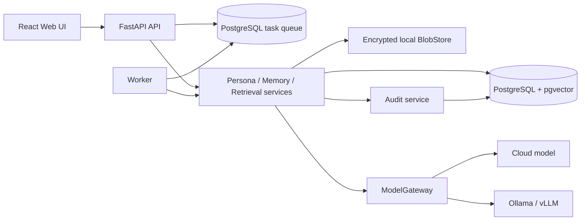
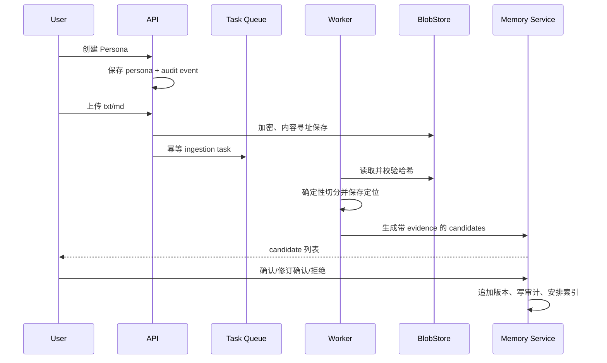

# PersonaOS 数字分身 MVP 实施方案

- 状态：已评审的实施基线；M1、M2、M3、M4、M5 已实现
- 日期：2026-07-25
- 仓库基线：`37daaa3` (`main`)
- 适用范围：第一阶段“数字员工”向第二阶段“证据驱动的数字分身”演进

> 实施进展（2026-07-25）：仓库版本已进入 `0.11.0`。M1 的审核优先资料入口与
> M2 的 embedding 空间、重向量任务、混合检索、对话、结构化回答、citation
> 校验和无证据边界均已落地。M3 已增加确认后版本编辑、记忆关系、敏感等级与
> 模型数据边界、可校验导出以及记忆/来源的级联删除。M4 已交付 React 工作台、
> 同源非 root Web 容器、免费虚构 Demo 和空环境 smoke；Compose 现在覆盖
> PostgreSQL/pgvector、API、Worker 与 Web。M5 补齐 Apache-2.0、社区与安全
> 政策、API/Skill/路线图/发布文档、依赖和镜像锁定、最小权限 CI、OpenAPI
> 快照及可执行 release gate。第 2–5 节仍保留审计当时的 `0.6.0` 事实快照，
> 避免用后来实现篡改基线。

## 1. 结论

当前仓库不是空项目。它已经实现了一个可运行、可测试的 GitHub 项目维护数字
员工：只读采集 GitHub 数据，执行两个 Skill，通过质量门禁后暂停等待人工审批，
并保存任务轨迹、产物、反馈、决策和候选偏好。

项目目前处于“第一阶段中期”：

- Agent Runtime、Skill、Workflow、持久化任务队列、人工审批和任务审计已有可用
  基线；
- Personal Layer 已有一条窄但真实的证据链，即从用户编辑/反馈生成候选偏好，
  经用户确认后才进入后续任务上下文；
- 人物档案、资料导入、通用长期记忆、混合检索、带原始来源引用的个人问答、
  Web 管理端和 Docker Compose 尚未实现。

因此不应重写现有项目，也不应先拆成十多个独立微服务。MVP 采用“模块化单体
+ API/Worker 两个进程 + PostgreSQL”的形态，保留现有稳定边界，在同一代码库
内新增人物、资料、记忆和检索模块。只有当负载或团队边界证明有必要时，再把
模块独立部署。

## 2. 本次审计范围与基线

已检查：

- `README.md`、`.env.example`、`pyproject.toml`、`start.sh`；
- `docs/architecture.md`、`docs/hermes.md`；
- `apps/api`、`apps/worker`；
- `core/agents`、`core/skills`、`core/workflows`、`core/services`、
  `core/storage`、`core/identity`、`core/evaluation`；
- GitHub、Hermes 和离线规则运行时适配器；
- 所有 YAML 定义和全部测试；
- Git 状态、提交历史、已跟踪文件和启动/部署资产。

基线验证：

```text
.venv/bin/pytest -q
34 passed in 2.18s
```

工作树在审计开始时干净，`main` 与本地记录的 `origin/main` 一致。仓库共有
7 个提交；当前包版本为 `0.6.0`。

## 3. 已有能力

| 能力 | 代码依据 | 评估 |
| --- | --- | --- |
| FastAPI API | `apps/api/main.py` | 已运行；当前以 `/docs` 作为操作界面 |
| API/Worker 分离 | `apps/api`、`apps/worker` | 已运行；HTTP 请求只入队 |
| 持久化任务队列 | `core/services/task_queue.py` | 有租约、重试、超时、取消和故障恢复 |
| 最小 Workflow | `core/workflows/engine.py` | 有条件、重试、检查点和人工暂停 |
| Agent Runtime 边界 | `core/agents/runtime.py` | 业务层不直接依赖具体模型框架 |
| 离线运行时 | `adapters/runtime/rule_based.py` | 可无模型费用完成当前演示和测试 |
| Hermes 适配器 | `adapters/hermes` | 进程外接入；强制检查远端无工具 |
| Skill 权限检查 | `core/skills/executor.py` | 会核对岗位允许工具，但定义格式仍较窄 |
| GitHub 只读工具 | `adapters/github` | 只实现读取；GitHub App token 不落库 |
| 质量门禁 | `core/evaluation/task_eval.py` | 校验报告字段、Issue 引用和证据 URL |
| 人工审批 | `ApprovalService` | 支持接受、修改后接受、拒绝 |
| 任务证据链 | `tasks`、`task_runs`、`tool_calls` 等表 | 能追踪当前项目维护任务 |
| 候选偏好 | `core/identity`、`PersonalizationService` | 有来源、置信度、审核状态和过期机制 |
| 自动化测试 | `tests/` | 34 项测试均通过；不调用付费服务 |
| 一键开发启动 | `start.sh` | 能启动 API、Worker 和可选 Hermes |

这些能力应复用。特别是 `AgentRuntime`、`WorkflowEngine`、`TaskWorker`、审批记录
和 Personal Context 边界，已经覆盖 MVP 所需的许多底层机制。

## 4. 对目标闭环的差距分析

| MVP 闭环 | 当前状态 | MVP 验收状态 |
| --- | --- | --- |
| 1. 创建数字人物档案 | 缺失；`users` 不是人物档案 | 新增独立 Persona CRUD 和归属边界 |
| 2. 导入文本资料 | 缺失 | 支持 UTF-8 文本和 Markdown，多文件、幂等导入 |
| 3. 保存原始资料并切分 | 缺失 | 原文不可静默改写；chunk 有稳定位置和哈希 |
| 4. 生成带来源的记忆候选 | 仅有任务反馈产生的偏好候选 | 支持多种记忆类型和逐条来源证据 |
| 5. 审核并确认记忆 | 仅偏好候选支持审核 | 通用记忆支持确认、拒绝和修订后确认 |
| 6. 索引确认后的记忆 | 缺失 | 仅 confirmed 版本进入词法/向量索引 |
| 7. 向数字人物提问 | 缺失 | 新增会话和提问 API |
| 8. 检索记忆并生成回答 | 缺失 | 混合召回、重排、受约束的模型回答 |
| 9. 展示记忆和原始来源 | GitHub 报告有 URL，不是人物问答引用 | 回答返回 Memory、版本、chunk 和原文定位 |
| 10. 查看、修改或删除记忆 | 偏好可查看/审核，不可通用编辑删除 | 修改创建新版本；删除清理索引并留无内容墓碑 |
| 11. 重要操作审计 | 有分散的任务轨迹 | 新增统一 append-only 审计事件 |
| 12. Docker Compose 本地启动 | 缺失；只有主机 `start.sh` | API、Worker、PostgreSQL、Web 一键启动 |

## 5. 主要技术债务

### P0：进入人物私密数据前必须处理

1. `user_id` 是调用方字符串，不是可信身份；任务列表、任务详情、取消和审批等
   API 也没有一致的所有者过滤。当前服务只能绑定本机，不能暴露到不可信网络。
2. 数据库通过 `create_all()` 自动建表，没有 Alembic 迁移，无法安全演进记忆
   schema 或部署 PostgreSQL。
3. SQLite 适合现有单机演示，但不足以承载并发 Worker、全文检索、向量检索和
   可靠租户策略。
4. 没有通用审计事件；现有审计信息散落在十余张任务表中，人物档案和记忆操作
   没有覆盖。
5. 没有原始资料的内容寻址、加密、删除语义和模型供应商数据边界。
6. 当前 API 在模块导入时构建全局容器并执行建表，启动副作用会妨碍迁移和测试
   隔离。

### P1：完成 MVP 闭环所需

1. `ExecutionStore` 已超过 2,000 行，混合连接、队列、审批和偏好职责。新增能力
   前应按领域拆 repository，但保持调用接口兼容。
2. Skill 定义只有输入名称列表、所需工具和浅层输出类型，缺少完整输入 Schema、
   权限声明、风险等级、超时、重试、人工确认、依赖、示例和测试清单。
3. Hermes 输出只做顶层字段和基础类型校验；新模型路径应使用完整 JSON Schema
   和领域级引用校验。
4. Workflow 状态会保存完整外部快照。人物资料不能默认复制到任务状态、模型日志
   和可观测性后端。
5. 没有模型调用记录、prompt/template 版本、embedding 空间或重新向量化机制。
6. 没有 Web UI、数据库集成测试、迁移测试、CI、锁文件或类型/静态检查。

### P2：开源发布前处理

1. 缺少 `LICENSE`、`CONTRIBUTING.md`、安全策略、行为准则和 Skill 开发指南。
2. README 中的少量“当前边界”描述落后于 0.6.0 实现。
3. 缺少演示资料、截图、架构图导出物和发布流程。
4. 没有 OpenTelemetry 接口，也没有对敏感字段的统一脱敏策略。

## 6. MVP 产品边界

### 包含

- 单机、本地优先的单用户体验，同时所有领域表显式保存 `owner_id` 和
  `persona_id`，避免以后迁移时重写数据；
- 创建、查看、修改和停用人物档案；
- 导入 `.txt` 和 `.md` 文件，单文件默认上限 5 MiB；
- 原始资料、确定性分块、记忆候选、人工审核、确认记忆、混合检索和带引用问答；
- 情景、语义、程序、偏好、关系、反思六类长期记忆，以及临时工作记忆的接口
  边界；
- 明确区分用户陈述、资料可验证事实、模型总结、模型推断、用户设定和临时生成；
- 修改版本、冲突/支持/派生关系的最小数据结构；
- PostgreSQL、pgvector、API、Worker 和 Web UI 的 Docker Compose；
- 无付费服务也可运行的确定性 Demo；接入模型时支持 OpenAI-compatible、
  Ollama 或 vLLM endpoint；
- 统一审计、数据导出和可验证删除的基础能力。

### 不包含

- 自主写 GitHub、邮件、日历或外部系统；
- 自动确认长期记忆；
- 无人工授权的人格、价值观或关系推断；
- 图数据库、复杂知识图谱推理或多 Agent 协作；
- 语音、数字人渲染、主动唤醒和 24/7 自主运行；
- “意识上传”“本人复制”或身份等同声明；
- 公网多租户 SaaS。登录和可信身份完成前，Compose 默认只绑定 localhost。

## 7. 架构决策与取舍

### 7.1 保留模块化单体，不立即微服务化

建议保留当前 Python 包和 API/Worker 进程边界：



逻辑模块可以与用户建议的名字一一对应，但无需先拆部署单元：

| 目标模块 | 当前复用/新增位置 |
| --- | --- |
| agent-runtime | 复用 `core/agents`，扩展会话上下文和回答约束 |
| model-gateway | 新增 `core/models` 与 `adapters/models` |
| skill-runtime | 演进 `core/skills` |
| tool-runtime | 将 `adapters/github` 纳入统一 Tool Protocol，新增文件工具 |
| memory-service | 新增 `core/memory` |
| identity-service | 演进 `core/identity`，人物档案与偏好分层 |
| knowledge-ingestion | 新增 `core/ingestion` |
| retrieval-engine | 新增 `core/retrieval` |
| task-service | 复用 `core/services/task_queue.py` 和 Workflow |
| audit-service | 新增 `core/audit`，桥接现有任务轨迹 |
| api-server | 演进 `apps/api` |
| web-ui | 新增 `apps/web` |
| digital-human-adapter | 只在 `core/digital_human` 定义 Protocol，不实现运行时 |

### 7.2 保留最小 Workflow 和任务队列

当前 Workflow 已有重试、条件、检查点和人工暂停，队列已有租约、取消、超时和
恢复，并有覆盖测试。MVP 不引入 LangGraph、Temporal、Celery 或另一个 Redis
服务来重复这些能力。

迁移 PostgreSQL 时，队列领取改为事务内的 `FOR UPDATE SKIP LOCKED`，并保持现有
状态机和 API。只有出现动态循环规划、并行图执行、跨日恢复或大量工作流类型后，
再用适配器评估 LangGraph 或 Temporal。LangGraph 官方能力确实覆盖持久化、
Human-in-the-loop 和故障恢复，但这些正是当前代码已经显式实现且可测试的部分。

### 7.3 模型网关采用项目协议，Pydantic AI 只作为适配器

新增稳定接口，而不是让领域服务依赖某个 Agent SDK：

```python
class ModelGateway(Protocol):
    async def generate_structured(self, request: GenerationRequest) -> GenerationResult: ...
    async def embed(self, request: EmbeddingRequest) -> EmbeddingResult: ...
```

首个生产适配器使用 Pydantic AI 的模型/Provider、结构化输出和 Embedder 抽象。
其官方文档列出多个原生 Provider，并支持自定义 OpenAI-compatible `base_url`，
包括 Ollama、LiteLLM 等，也提供本地 Sentence Transformers embedding。项目仍
保留 `AgentRuntime`，Pydantic AI 类型不得进入 `core/memory`、`core/retrieval`
或数据库模型。

LiteLLM Proxy 可作为以后多团队的可选部署组件，用于集中鉴权、限流和成本统计，
但不作为本地 MVP 的强制服务。Hermes 继续作为可选 Agent Runtime，不拥有本项目
的长期记忆真源。

### 7.4 PostgreSQL + pgvector 是唯一默认数据平面

MVP 不引入独立向量数据库或图数据库：

- 结构化数据、全文/模糊检索、向量和关系边统一留在 PostgreSQL，便于事务、
  删除、导出和审计；
- pgvector 支持精确检索、HNSW/IVFFlat 以及与 PostgreSQL 全文检索组合；
- 初期数据量小，默认使用精确向量检索，先建立召回评测，再决定 HNSW 参数；
- 关系先用 `memory_relations` 邻接表；出现多跳图查询瓶颈后再评估图数据库。

数据库变更统一使用 Alembic。应用启动只执行 `alembic upgrade head` 或检查 schema
版本，不再调用 `create_all()` 变更生产 schema。Alembic 的 `check` 应进入 CI，
防止 ORM 和迁移漂移。

### 7.5 Embedding 空间显式版本化

不能只在 Memory 行上放一个没有身份的向量。设计：

- `embedding_spaces` 保存 provider、模型、发布版本、维度、距离度量、归一化
  方式和配置哈希；
- `memory_embeddings` 使用 `(memory_version_id, embedding_space_id)` 唯一键；
- 查询必须指定一个空间，SQL 强制按 `embedding_space_id` 过滤；
- 切换模型时创建新空间并后台回填，旧空间保持可查询，验证完成后再切换 active；
- 不同空间的相似度不得直接合并；
- pgvector 可在同一无固定维度的 `vector` 列保存不同维度，但索引必须按空间使用
  partial/expression index。MVP 小数据量先做精确查询，可避免提前生成大量索引。

### 7.6 混合召回而不是纯向量召回

每次问答的候选集合按以下顺序产生：

1. 权限硬过滤：`owner_id`、`persona_id`、confirmed、未删除、可见级别；
2. PostgreSQL 全文检索；中文等分词不足的内容同时使用 `pg_trgm`；
3. 当前 active embedding 空间内的向量召回；
4. 按 RRF 合并词法和向量名次；
5. 加入受限的时间、重要度和关系信号；
6. 记录每路原始分数和最终名次，交给回答生成器。

模型只能引用本次召回结果中的稳定 citation ID。服务端在返回前校验引用是否存在，
无有效证据时返回“没有找到相关记忆”，不能让模型补造来源。

### 7.7 原始文件使用可替换 BlobStore

MVP 默认实现内容寻址的本地 BlobStore：

- 原文件名只作显示信息，不参与磁盘路径；
- object key 由 SHA-256 派生，防止路径穿越和重复存储；
- 写入采用临时文件、`fsync` 和原子重命名；
- 原始 blob 默认使用 AES-GCM 加密，密钥从环境/secret file 注入，不写数据库；
- 元数据和内容访问都必须先经过 persona 所有权检查；
- 后续可增加 S3/MinIO 适配器，不改变 ingestion 领域接口。

数据库中的可检索记忆内容仍需要主机磁盘/卷加密。应用层加密全部检索字段会破坏
全文和向量索引，因此 README 必须明确这一部署前提，不能声称 Docker volume
本身提供静态加密。

### 7.8 React + Vite，而不是 Next.js

MVP 是本地管理 SPA，不需要 SSR、Edge runtime 或第二套服务端业务逻辑。选择
React + TypeScript + Vite，构建后由轻量静态服务器提供，所有数据操作通过
FastAPI。未来若出现公开内容页或 SSR 需求，再评估 Next.js。

### 7.9 可观测性与领域审计分离

- `audit_events` 是产品证据，必须持久化、可导出，不依赖外部平台；
- OpenTelemetry 是运行观测接口，默认可关闭，不能默认导出原文、prompt、token、
  Cookie、Authorization 或文件内容；
- 模型调用记录保存 provider/model、模板版本、输入引用、哈希、token 用量、
  时延和错误；敏感原始 prompt 默认不重复保存。

## 8. 目标数据模型

### 8.1 人物和资料

`personas`

- `id`、`owner_id`、`display_name`、`description`；
- `simulation_notice`：固定说明这是基于资料的模拟智能体；
- `status`：active / suspended / deleted；
- `version`、`created_at`、`updated_at`、`deleted_at`。

`source_documents`

- `id`、`persona_id`、`owner_id`；
- `source_type`、`original_filename`、`media_type`、`language`；
- `object_key`、`content_sha256`、`byte_size`；
- `status`：uploaded / processing / ready / failed / deleting / deleted；
- `ingestion_version`、`created_at`、`processed_at`、`deleted_at`。

`document_chunks`

- `id`、`document_id`、`persona_id`、`ordinal`；
- `content`、`content_sha256`；
- `char_start`、`char_end`、`line_start`、`line_end`；
- `locator` JSON，用于未来页码、时间码或消息 ID；
- chunker 名称、版本和参数哈希。

原始资料不可被模型覆盖。重新导入或重新切分产生新 document/chunk 版本。

### 8.2 记忆、版本和证据

`memories`

- `id`、`persona_id`、`owner_id`；
- `memory_type`：episodic / semantic / procedural / preference /
  relationship / reflection；
- `status`：candidate / confirmed / rejected / superseded / deleted；
- `epistemic_status`：user_asserted / source_verified / model_summary /
  model_inference / user_rule；
- `current_version_id`；
- `confidence`、`importance`、`sensitivity`、`visibility`；
- `event_at`、`created_at`、`updated_at`、`deleted_at`；
- `confirmed_by`、`confirmed_at`。

`memory_versions`

- `id`、`memory_id`、递增 `version`；
- `raw_content`、`structured_summary`、`metadata_snapshot`；
- `created_by_type`、`created_by_id`、`change_reason`；
- `extractor_name/version`、`model_call_id`、`created_at`。

版本只追加。用户修改不会覆盖旧内容；`memories.current_version_id` 指向当前版本。

`memory_evidence`

- `memory_version_id`；
- `source_document_id`、`document_chunk_id`；
- `relation`：supports / contradicts / derived_from；
- `locator_snapshot`、`excerpt`、`excerpt_sha256`；
- `created_at`。

`memory_relations`

- `from_memory_id`、`to_memory_id`；
- `relation`：supports / conflicts / derived_from / supersedes / related_to；
- `confidence`、`created_by_type`、`evidence`、`created_at`。

`embedding_spaces` 与 `memory_embeddings` 按 7.5 节实现。只为 confirmed 的当前
MemoryVersion 建索引；候选、拒绝、已删除内容不得进入回答检索。

### 8.3 会话、检索和引用

`conversations`、`messages`

- 始终绑定 `owner_id` 和 `persona_id`；
- 每条消息区分 user / assistant / tool；
- assistant 消息保存结构化的不确定性和 simulation notice。

`retrieval_runs`

- query 哈希、使用的 embedding space、过滤条件；
- 各召回通道的候选、原始分数、RRF 分数和最终顺序；
- prompt/template 版本与生成调用关联。

`answer_citations`

- `message_id`、`memory_id`、`memory_version_id`；
- `document_id`、`chunk_id`、`locator_snapshot`；
- `claim_index`、`excerpt`、`rank`。

引用是回答产物的一部分，不从自由文本脚注反向解析。

### 8.4 统一审计

`audit_events`

- `id`、`occurred_at`、`request_id`、`correlation_id`；
- `actor_type`、`actor_id`；
- `owner_id`、`persona_id`；
- `action`、`resource_type`、`resource_id`；
- `outcome`、`risk_level`、`approval_id`；
- `before_hash`、`after_hash`、经过脱敏的 `detail`。

审计事件追加写入，不保存已删除资料的明文副本。删除后可保留资源 ID、时间、
操作者和内容哈希，以同时满足可追责和实际内容删除。

## 9. 核心流程

### 9.1 资料导入到记忆确认



规则：

- 上传成功不等于长期记忆写入成功；
- 每个候选至少有一个有效 chunk 证据，否则提取任务失败；
- 模型推断必须标记 `model_inference`，默认需要确认；
- 候选生成失败不能破坏原始资料，任务可安全重试；
- 同一 persona + 内容哈希的重复上传幂等返回已有 document。

### 9.2 提问到带引用回答

1. 验证调用者对 Persona 的访问；
2. 保存用户消息和 retrieval run；
3. 仅检索已确认、未删除且当前可见的 MemoryVersion；
4. 组装包含 citation ID、记忆类型、真实性类别和来源定位的上下文；
5. 模型返回结构化 `answer`、`claims[]`、`uncertainty`；
6. 服务端验证每个 claim 引用都属于本次召回集合；
7. 没有证据时返回固定边界响应，不调用模型补全个人事实；
8. 保存 assistant message、citations、model call 和 audit event；
9. UI 展开 citation 时显示 Memory 版本及原始资料位置。

## 10. API 草案

| 方法 | 路径 | 用途 |
| --- | --- | --- |
| POST | `/api/v1/personas` | 创建人物档案 |
| GET | `/api/v1/personas` | 查看当前所有者的人物 |
| GET/PATCH | `/api/v1/personas/{id}` | 查看或版本化修改人物档案 |
| DELETE | `/api/v1/personas/{id}` | 发起可审计的停用/删除 |
| POST | `/api/v1/personas/{id}/documents` | 上传文本资料 |
| GET | `/api/v1/personas/{id}/documents` | 查看资料和处理状态 |
| GET | `/api/v1/documents/{id}` | 查看原始资料元数据和 chunks |
| DELETE | `/api/v1/documents/{id}` | 删除资料及其派生索引 |
| GET | `/api/v1/personas/{id}/memory-candidates` | 查看待审核候选 |
| POST | `/api/v1/memory-candidates/{id}/review` | 确认、修订确认或拒绝 |
| GET | `/api/v1/personas/{id}/memories` | 搜索/筛选已确认记忆 |
| GET/PATCH/DELETE | `/api/v1/memories/{id}` | 查看、追加版本或删除 |
| POST | `/api/v1/personas/{id}/conversations` | 创建会话 |
| POST | `/api/v1/conversations/{id}/messages` | 提问并取得带引用回答 |
| GET | `/api/v1/messages/{id}/citations` | 展开回答证据 |
| GET | `/api/v1/personas/{id}/audit-events` | 查看人物相关审计 |
| POST | `/api/v1/personas/{id}/export` | 导出档案、资料索引和记忆 |

首个本地版本可以使用单用户 `LocalPrincipal`，但领域服务必须接收
`AccessContext`，不能继续把请求体中的 `user_id` 当作授权依据。所有 ID 查询都
同时过滤 owner；找不到和无权访问统一返回 404，避免枚举资源。

## 11. Skill 演进

现有 YAML 继续兼容读取，新版 Schema 增加：

- `input_schema`、`output_schema`：完整 JSON Schema；
- `permissions`、`allowed_tools`；
- `timeout_seconds`、`retry_policy`；
- `risk_level`、`requires_confirmation`；
- `dependencies`、`examples`、`test_cases`；
- `version` 和定义内容哈希。

MVP 首批 Skill：

1. `text-ingestion`：验证、解码、切分文本；
2. `memory-candidate-extraction`：从 chunks 生成有证据候选；
3. `memory-search`：执行有权限过滤的混合检索；
4. `persona-qa`：只依据召回证据生成带引用回答。

它们必须通过现有 `SkillExecutor` 权限边界。文件读取和 embedding 是明确工具，
不能让模型自行访问本地文件系统。

## 12. 安全与隐私基线

MVP 合并门槛：

- 默认监听 `127.0.0.1`；没有可信认证时拒绝配置公网绑定，除非设置显式的
  `UNSAFE_ALLOW_PUBLIC_WITHOUT_AUTH` 开发开关并显示警告；
- 所有领域查询强制 owner/persona 过滤，并有越权测试；
- 原始 blob 加密、路径安全、大小限制、MIME/编码白名单和内容哈希校验；
- secrets 只从环境或 secret file 读取，`repr`、错误和日志不得包含密钥；
- 每个 Model 配置声明 `data_boundary`：local / private_network / external；
- 调用 external provider 前，人物配置必须允许该边界；UI 显示将发送的数据；
- prompt 把导入资料标记为不可信数据；资料内容不能授予工具权限；
- 高风险工具仍走现有审批机制；记忆确认不能授权外部副作用；
- 删除按依赖图清除 blob、chunk、embedding 和可识别正文，保留无正文审计墓碑；
- 导出包含 schema 版本、MemoryVersion、来源定位、embedding 元数据，不要求导出
  不可移植的向量本身；
- 明确显示“这是基于授权资料的模拟智能体，不是现实中的本人”。

## 13. 兼容迁移策略

1. 引入 Alembic，并为当前 0.6.0 schema 建立基线迁移；
2. 测试继续支持 SQLite 内存数据库，正式 Compose 使用 PostgreSQL；
3. `Database.create_schema()` 暂时只供测试，生产启动改为迁移检查；
4. 新表以外键关联现有 `users`，但 Persona 与 User 保持不同概念；
5. 现有 `memory_sources` 和 `preferences` 不重命名、不塞入新语义；
6. 增加 bridge，把已有 feedback/decision source 映射为新的 evidence source，
   但仅在用户触发迁移时生成候选，不自动确认；
7. 现有 GitHub 维护 API、任务状态和 34 项测试必须保持兼容；
8. 将 `ExecutionStore` 按队列、执行轨迹、连接、个人化逐步拆分，先委托再迁移，
   不做一次性重写。

## 14. 里程碑与验收

### M1：人物资料到记忆确认的证据入口闭环

交付：

- Alembic 基线与 PostgreSQL 开发配置；
- Persona、SourceDocument、DocumentChunk、Memory/MemoryVersion、
  MemoryEvidence、AuditEvent；
- 加密本地 BlobStore、确定性文本切分；
- 人物创建、文本上传、候选列表和确认/拒绝 API；
- 规则版候选提取器与可替换模型接口；
- 端到端测试覆盖“创建人物 → 导入 → 候选 → 确认 → 审计”；
- 保持现有 GitHub 闭环和全部旧测试通过。

验收命令至少包括：

```text
pytest
alembic upgrade head
alembic check
docker compose config
```

### M2：确认记忆的混合检索与带引用问答

交付 embedding 空间、重新向量化任务、词法/向量/RRF 检索、对话记录、结构化
回答、citation 校验和“无证据”边界。用固定评测集验证越权记忆零召回、citation
完整性和 embedding 空间不混用。

### M3：记忆管理、冲突和隐私生命周期

交付记忆查看、版本化修改、删除/级联清理、支持/冲突/派生关系、资料导出、模型
数据边界策略和敏感等级过滤。删除测试必须证明 blob、chunk、embedding 和搜索
结果都已移除，审计中不残留正文。

### M4：Web UI 与一键本地演示

交付 React UI 的人物、导入、候选审核、记忆、问答引用、任务和审计页面；
Compose 启动 API、Worker、PostgreSQL/pgvector 和 Web；提供无付费服务的最小
Demo 数据、健康检查和从空环境开始的 smoke test。

### M5：开源发布门槛

补齐 LICENSE、贡献指南、Skill 开发指南、安全策略、API 文档、架构图、路线图、
CI、依赖锁定和发布说明。README 在五分钟内演示完整闭环，同时保留真实性和
算力边界说明。

每个里程碑独立可运行、可测试、可演示。不得为了后续里程碑提前创建没有行为的
空目录或大量 TODO。

## 15. M1、M2、M3、M4、M5 实施结果与唯一下一里程碑

M1 已按以下边界落地：

1. Persona 归属于服务端配置的本地 principal，而不是请求方伪造的用户 ID；
2. `.txt`/`.md` 原文按 SHA-256 内容寻址，并以 AES-256-GCM 保存到本地 Blob；
3. chunk 保留字符偏移、行号、内容哈希和 chunker 配置哈希；
4. 每个规则候选绑定 document、chunk、locator、excerpt 和不可变版本；
5. 确认无论是否修订内容，都会新建 `user_confirmed=true` 的 MemoryVersion；
6. 上传、处理和 Worker 重放幂等，重要状态变化进入统一 AuditEvent；
7. Alembic 基线与 PostgreSQL/pgvector Compose 已加入，SQLite 保留兼容测试；
8. 原始正文不进入 task/workflow/tool trace，候选不会被自动确认。

M2 在此基础上增加：

1. embedding space 由 provider、模型名/版本、维度、模板和配置哈希唯一标识；
2. 只为 confirmed 当前版本写向量，新空间重向量时不覆盖旧空间；
3. 检索先执行 owner/persona/status/visibility/source 硬过滤，再合并词法、
   当前空间 cosine 和 RRF 排名；
4. Conversation、Message、RetrievalRun、ModelCall 和 AnswerCitation 均持久化；
5. 每个 claim 的 citation 在落库前校验，并固定到当前 MemoryVersion、Evidence、
   DocumentChunk 和 SourceDocument；
6. 没有证据时返回固定边界响应，模型调用记录为 `skipped`；
7. 固定评测检查越权召回、embedding 空间串用、悬空引用和无证据边界。

M3 继续完成隐私生命周期：

1. 确认记忆修改要求 `expected_version`，只追加不可变版本；用户改写正文会
   降格为 `user_asserted`、`source_bound=false`，证据关系改为
   `derived_from`；
2. 关系记录支持 supports、conflicts、derived_from、supersedes 与 related_to，
   并校验 owner、Persona、确认状态和证据版本归属；
3. Persona 默认只允许 local 模型边界；private network 排除 restricted，
   external 只允许 public 且启用时要求显式确认；
4. 模型敏感等级过滤同时进入 embedding 候选、词法、向量和证据查询，边界在
   RetrievalRun 与 ModelCall 中固化；
5. 记忆删除清理全部版本、证据、关系与 embedding，并擦除曾使用目标上下文的
   回答正文和引用；
6. 来源删除先取消排队中的导入任务，再以 deleting 状态协调 Blob 与数据库；
   只有全局最后一个 object key 引用删除时才移除加密 Blob；
7. JSON 导出可选择原始资料，包含证据链和审计但不包含向量数组或内部 object
   key，并生成 SHA-256 manifest 和导出审计；
8. 删除审计只保留资源 ID、内容哈希和级联计数，重复请求返回同一墓碑回执。

M4 把上述能力形成可操作产品入口：

1. React/TypeScript 工作台覆盖人物总览、资料上传/状态/分块、候选逐条审核、
   记忆版本/敏感等级/关系、问答 citation、任务轨迹和审计/导出；
2. UI 明示模拟边界、真实性类别和证据定位；没有证据的回答展示未调用模型原因，
   删除来源/记忆使用独立高风险确认对话框；
3. 浏览器只调用同源 API，不持有模型、数据库或 Blob 密钥；owner、版本冲突、
   模型边界、删除依赖图和审计仍由后端强制执行；
4. Vite 生成静态资产，非 root Nginx 提供 `/healthz` 并代理 `/health` 与
   `/api/*`；CSP 禁止跨源脚本/连接、嵌入和无关设备权限；
5. Compose 增加只绑定 `127.0.0.1:18111` 的 Web 服务，继续保留
   `127.0.0.1:18110` API 兼容入口；
6. 页面可显式载入无需 API Key 的虚构 Demo，但不会自动确认候选；独立 smoke
   经 Web origin 验证人物、导入、Worker、测试确认、引用和审计；
7. 前端精确版本写入 npm lockfile，组件测试覆盖人物创建、人工审核门禁和可解析
   citation，生产构建同时执行严格 TypeScript 检查。

M5 把工程闭环提升为可审查的开源发布基线：

1. 使用 Apache-2.0，增加 NOTICE、贡献指南、社区行为准则、私密漏洞报告策略、
   Issue forms 和 PR 安全/证据清单；
2. README 提供无需 API Key 的五分钟演示、真实性和数字人运行算力边界，并链接
   可访问 SVG 架构图、路线图、API、Skill 与发布说明；
3. Python production/dev 解析均精确到版本并保存 PyPI SHA-256，npm 保持
   lockfile v3；Docker、start.sh 和 CI 实际消费 lock；
4. Python、Node、Nginx 和 PostgreSQL/pgvector 镜像固定可读 tag 与多架构
   manifest digest；GitHub Action 固定完整 commit SHA；
5. CI 默认只有 `contents: read`，分别执行后端/迁移/release gate、Web 构建与
   audit、真实 PostgreSQL/pgvector/API/Worker/Nginx Compose smoke；
6. OpenAPI 从临时离线应用实例确定性生成，提交版本快照并在 CI 阻止漂移；
7. release gate 自动检查版本、许可证、社区文件、hash lock、容器 digest、
   Action SHA、README 边界、SVG 可访问性和 OpenAPI 一致性；
8. ADR 0003 记录许可证、锁定、最小权限 CI 和不自动发布 tag 的取舍。

当前离线 embedding 是可复现的 Unicode 特征哈希，不是高质量语义模型；回答
生成器只复述证据，不做开放式模型归纳。`source_verified` 仍只表示内容能逐字
定位回资料，并不证明资料陈述是客观事实。

M3 验证结果为：`56 passed`；变更文件 Ruff 静态检查通过；SQLite migration
完成 upgrade/check/downgrade。端到端测试证明外部生成与外部 embedding 只能
接收 public 记忆；来源删除后 Blob、chunk、memory/version/evidence、全部
embedding、citation、词法和向量检索结果均已移除，派生回答已擦除，审计中没有
原正文。共享 Blob 的最后引用语义、重复删除回执和无向量导出也有自动化覆盖。
执行环境没有 Docker，因此 Compose 只完成配置与安全约束测试；真实
PostgreSQL/pgvector 容器查询尚未在本机执行。

M4 的本机验收结果为：`npm ci` 审计 0 个已知漏洞，Vitest `3 passed`，严格
TypeScript 检查与 Vite 生产构建通过；Python `59 passed`，Ruff 全量检查通过。
经 Vite 同源入口连接真实 SQLite API/Worker 的 smoke 已完成，回答返回 `C1` 并
解析到本次上传文件的行号定位，审计包含人物创建、资料上传/处理、记忆确认、
索引和问题回答。执行环境没有 Docker/Podman，因此真实 PostgreSQL/pgvector、
Nginx 容器和 `docker compose config` 未执行；Compose 只通过 YAML、安全约束与
交付资产自动化测试，不能把这些结果当作真实容器验收。

唯一下一里程碑是 **M6：可信本地账户与人物空间隔离**。把服务端固定
`local-user` 升级为可信会话，让两个账户的人物、资料、记忆、检索、导出、任务
和审计具备可自动证明的零越权边界，并提供 0.11 单所有者数据的显式迁移。

## 16. 调研依据

- [pgvector 官方 README](https://github.com/pgvector/pgvector)：精确/HNSW/IVFFlat、
  hybrid search、不同维度向量和 partial index；
- [pgvector-python 官方 README](https://github.com/pgvector/pgvector-python)：
  SQLAlchemy `VECTOR` 类型、cosine distance 和 Psycopg 适配；
- [PostgreSQL 全文检索文档](https://www.postgresql.org/docs/current/textsearch-controls.html)：
  `tsvector`、`tsquery`、`ts_rank_cd` 和 headline；
- [PostgreSQL Row Security Policies](https://www.postgresql.org/docs/current/ddl-rowsecurity.html)：
  行级策略的能力和默认拒绝语义；
- [Alembic Tutorial](https://alembic.sqlalchemy.org/en/latest/tutorial.html) 与
  [Autogenerate Check](https://alembic.sqlalchemy.org/en/latest/autogenerate.html)：
  SQLAlchemy schema 迁移和 CI 漂移检查；
- [Pydantic AI 模型概览](https://pydantic.dev/docs/ai/models/overview/) 与
  [OpenAI-compatible 配置](https://pydantic.dev/docs/ai/models/openai/)：
  Provider 抽象、自定义 base URL、本地/云模型兼容；
- [Pydantic AI Embeddings](https://pydantic.dev/docs/ai/guides/embeddings)：
  query/document embedding、Provider 元数据和切换空间时重新索引的边界；
- [Pydantic AI Deferred Tools](https://pydantic.dev/docs/ai/tools-toolsets/deferred-tools/)：
  人工审批不能替代工具内部授权；
- [LangGraph Persistence](https://docs.langchain.com/oss/python/langgraph/persistence)：
  持久化、Human-in-the-loop 和故障恢复能力，用作后续替换阈值参考；
- [Temporal 文档](https://docs.temporal.io/)：长期 durable execution 的后续选项；
- [OpenTelemetry Python Instrumentation](https://opentelemetry.io/docs/languages/python/instrumentation/)：
  可替换的运行观测接口。
- [PostgreSQL Constraints](https://www.postgresql.org/docs/current/ddl-constraints.html)：
  外键、唯一约束与检查约束的数据库级完整性边界；
- [PostgreSQL BEGIN](https://www.postgresql.org/docs/current/sql-begin.html)：
  版本切换和关系/索引级联清理使用显式事务保证一致性；
- [NIST SP 800-88 Rev. 2](https://csrc.nist.gov/pubs/sp/800/88/r2/final)：
  区分应用层删除回执与存储介质净化，避免把数据库/Blob 删除夸大为物理擦除。
- [React Build from Scratch](https://react.dev/learn/build-a-react-app-from-scratch)：
  React/TypeScript 客户端使用 Vite 构建的官方路径与非框架方案取舍。
- [Vite Getting Started](https://vite.dev/guide/) 与
  [Vitest Getting Started](https://vitest.dev/guide/)：静态生产构建、Node
  兼容要求及共享 Vite 配置的组件测试。
- [NGINX proxy module](https://nginx.org/en/docs/http/ngx_http_proxy_module.html)：
  Web 容器同源代理路径、header 和 timeout 语义。
